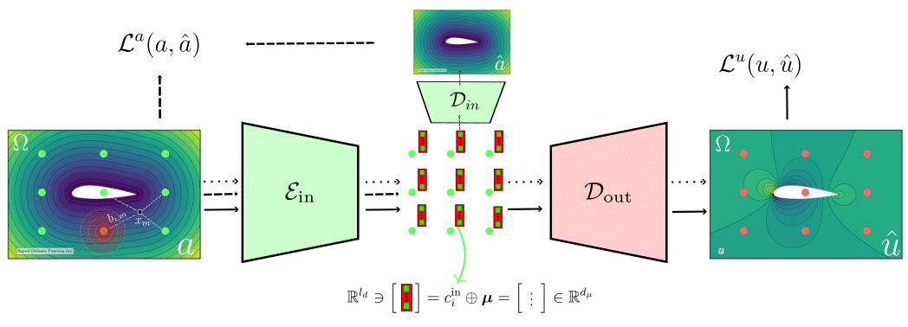
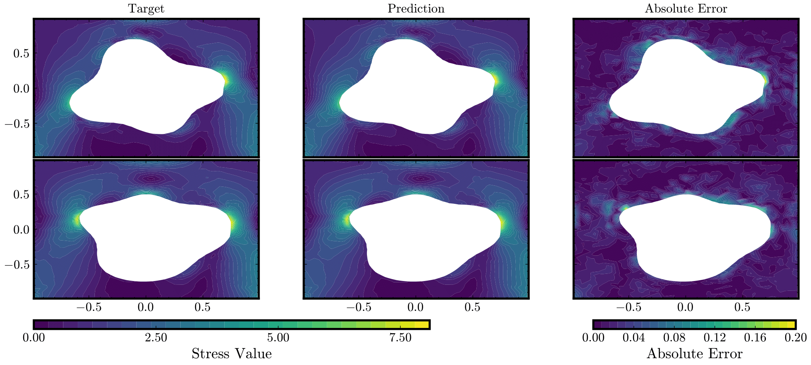
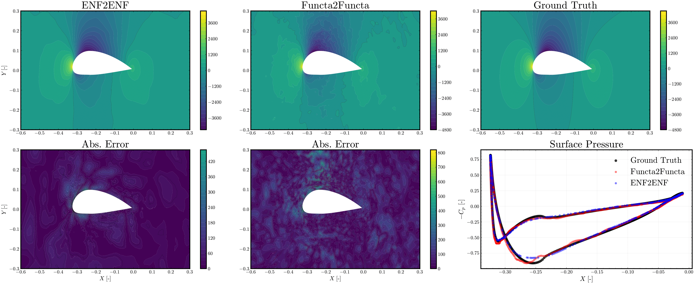
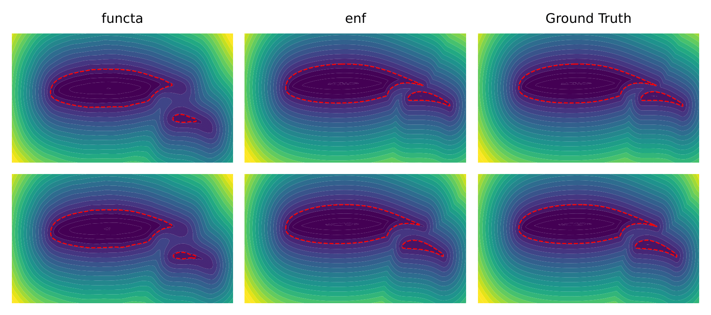

# Equivariant Neural Field Networks for steady PDE surrogates on general geometries.

This repository contains the implementation of enf2enf, a neural operator approach to solve steady state PDEs on general geometries.
The code can be ued to reproduce the experiments described in the paper [Geometry aware inference of steady state PDEs using Equivariant Neural Fields representations](https://arxiv.org/abs/2504.18591). The backbone architecture is taken from the original JAX implementation of Equivariant Neural Fields: https://github.com/david-knigge/enf-pde. The pytorch implementation of enf2enf cis also available at: https://github.com/giovannicatalani/enf2enf_pytorch.

## Architecture Overview

Our architecture leverages equivariant neural fields to learn PDE solutions across different domains. The network processes geometric features and produces accurate field predictions while maintaining equivariance properties.



## Experiments

### Elasticity Problem

The model learns deformation fields in elastic materials.



To run experiments:
```bash
python elasticity.py
```

### Airfrans Dataset

For airfoil simulations, we use the AirFRANS dataset to predict flow fields around airfoils at different angles of attack and flow conditions. 


To run experiments:
```bash
python airfrans_full.py
```
### Multi-element Airfoil

This is an experiment to learn shape ebdedding of multi-element airfoil generated from a variation of the base fowler flap airfoil whose geometry is contained in multi_airfoil/fowler_flap_airfoil.txt. 
The dataset can be generated using the dedicated script, with utilities to generate and compute the Signed Distance Function on multiple 2D polygons.

```bash
cd multi_airfoil
python generate_db.py
```
To run the enf shape fitting:
```bash
python multi_element_airfoil.py
```
To run the baseline functa fitting
```bash
cd multi_airfoil
python fit_functa.py
```



## Data
Data for Airfrans dataset can be found by downloading the airfrans package.
```bash
pip install airfrans
```

Data for elasticity dataset can be found at https://drive.google.com/drive/folders/1YBuaoTdOSr_qzaow-G-iwvbUI7fiUzu8 .

